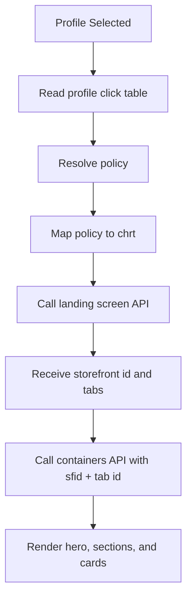

# Sony LIV POC: Cohort Personalization Logic

Last updated: 2026-06-28

## Executive Summary

The current POC uses a lightweight, explainable cohort personalization model. Each profile builds its own viewing-interest signal from content taps. The app classifies every content tap into one of three intent buckets:

- Entertainment
- Sports
- Reality

From those three buckets, the app resolves one of six storefront policies and passes that policy to the storefront API using the `chrt` query parameter. Backend storefront configuration then decides the actual rails, hero, and content mix for that policy.

This gives us a demo-friendly version of personalization without needing a machine-learning pipeline yet. It also keeps the system future-ready because the scoring layer can later be replaced by a backend model or recommendation service.

## Current Objective

The POC is designed to answer this question:

> Based on what this profile clicks, which storefront experience should we request next?

The current implementation does not reorder individual cards locally. Instead, it selects the most relevant storefront policy and lets the backend return the appropriate storefront layout.

## Core Concepts

| Concept | Meaning |
|---|---|
| Profile | The viewing identity. Cohort state is stored per profile, not per account. |
| Content tap | User selects a card/content item from storefront, search, or rails. |
| Signal | The detected category of that tap: Entertainment, Sports, or Reality. |
| Policy | The resolved storefront variant to request from backend. |
| `chrt` | Query parameter sent to storefront APIs to select the backend-curated policy. |

## Why Per Profile?

An OTT account can have multiple viewers. Personalization should follow the viewer profile, not the account owner.

Example:

| Account | Profile | Expected Storefront |
|---|---|---|
| Same account | Parent | Entertainment / Reality |
| Same account | Sports fan | Sports-first |
| Same account | Kid | Kids-safe / profile-specific |

This is why the click counters and manual test override are stored by profile id.

## Signal Capture

When the user taps content, the app reads metadata from the selected card:

- `cust_sc`
- `cty`
- card `ty`
- `cust_id`
- title

The app converts this metadata into one of three signals:

| Detected metadata | Signal |
|---|---|
| Contains `sport`, `match`, `cricket`, `football` | Sports |
| Contains `show` or `reality` | Reality |
| Anything else | Entertainment |

This is intentionally simple for the POC. The production version should move this classification to backend metadata or a recommendation service so the client does not need keyword rules.

## Stored Click Table

Each profile has a local click table:

```text
profile_id -> {
  entertainment: count,
  sports: count,
  reality: count
}
```

Example:

```json
{
  "profile_123": {
    "entertainment": 20,
    "sports": 50,
    "reality": 30
  }
}
```

## Cohort Resolution Algorithm

The app converts total clicks into percentage share.

```text
entertainmentShare = entertainmentClicks / totalClicks
sportsShare = sportsClicks / totalClicks
realityShare = realityClicks / totalClicks
```

Then it applies the decision logic:

1. If there are no clicks, default to Entertainment.
2. If any category has at least 70% share, choose that pure cohort.
3. If no category reaches 70%, drop the weakest category.
4. Choose the blend of the remaining two categories.
5. If all three are tied, default to Entertainment for stability.

## Six POC Storefront Policies

| Resolved Policy | `chrt` Value | Meaning |
|---|---|---|
| Entertainment | `entertainment` | Default entertainment storefront |
| Reality + Entertainment | `sony2` | Reality signal boosted into entertainment |
| Reality | `reality` | Full reality storefront |
| Reality + Sports | `sony3` | Reality storefront with sports influence |
| Sports + Entertainment | `sony1` | Sports signal boosted into entertainment |
| Sports | `sports` | Full sports storefront |

## Example Decisions

### Example 1: Sports-heavy profile

```text
Sports = 80
Reality = 10
Entertainment = 10
Total = 100
```

Sports share is 80%, which is above the 70% pure threshold.

Result:

```text
Policy = Sports
chrt = sports
```

### Example 2: Mixed sports and reality profile

```text
Sports = 50
Reality = 30
Entertainment = 20
Total = 100
```

No category reaches 70%. The weakest category is Entertainment. The remaining two are Sports and Reality.

Result:

```text
Policy = Reality + Sports
chrt = sony3
```

### Example 3: Balanced profile

```text
Sports = 10
Reality = 10
Entertainment = 10
Total = 30
```

All categories are tied, so the app defaults to Entertainment for a stable fallback.

Result:

```text
Policy = Entertainment
chrt = entertainment
```

### Example 4: Entertainment and sports mix

```text
Sports = 35
Reality = 10
Entertainment = 55
Total = 100
```

No category reaches 70%. The weakest category is Reality. The remaining two are Entertainment and Sports.

Result:

```text
Policy = Sports + Entertainment
chrt = sony1
```

## Storefront API Flow

When the app needs to load storefront for the selected profile:

1. Resolve current profile.
2. Resolve storefront policy for that profile.
3. Pass the policy as `chrt`.
4. Call landing screen to get storefront id and tabs.
5. Call containers API using storefront id and selected tab id.

Simplified flow:



## Request Parameters

The key personalization parameter is:

```text
chrt=<resolved policy>
```

Example:

```text
chrt=sports
```

or:

```text
chrt=sony3
```

The current POC keeps `pf=regular` for these policies. The policy variation is primarily controlled by `chrt`.

## Manual QA Override

For testing, profile edit has a six-option Storefront Test Policy selector.

When QA selects a policy and saves:

1. The selected policy is stored for that profile.
2. That profile's click counters are cleared.
3. The selected policy takes precedence over dynamic click resolution.

This makes it easy to force-test all six storefront variants without manually clicking many cards.

## What Is Implemented Today

| Area | Status |
|---|---|
| Per-profile click table | Implemented |
| Three signal buckets | Implemented |
| Six policy mapping | Implemented |
| 70% pure cohort threshold | Implemented |
| Blend by dropping weakest category | Implemented |
| `chrt` mapping | Implemented |
| Manual six-policy selector in profile edit | Implemented |
| Click reset when QA override is saved | Implemented |
| Backend model-driven recommendation | Not implemented |
| Server-side event pipeline | Not implemented |
| Cross-device cohort sync | Not implemented |

## Current Limitations

This is a POC-grade client-side implementation. It is intentionally simple and explainable.

Known limitations:

- Click data is local to the device.
- Classification uses metadata keywords.
- No watch-duration weighting yet.
- No negative signal handling yet, such as skips or short exits.
- No freshness, country, subscription, or language weighting in cohort resolution.
- Manual override is for QA/testing and should not be used as production personalization.

## Recommended Production Evolution

### Phase 1: Current POC

Client stores per-profile click counters and passes `chrt` to backend.

### Phase 2: Backend Event Sync

Move events to backend:

```text
content_impression
content_click
detail_open
play_start
watch_duration
watch_complete
favorite
search
```

Backend stores profile-level interest scores.

### Phase 3: Backend Policy Resolver

Backend resolves:

```text
profile_id -> storefront policy -> chrt
```

Client only sends profile id/context and renders returned storefront.

### Phase 4: Recommendation Model

Use ML/ranking to generate:

- personalized hero
- personalized rail order
- personalized card order
- continue watching
- more like this
- because you watched
- trending in your region

## Client/Backend Ownership Recommendation

| Responsibility | POC | Production Recommendation |
|---|---|---|
| Capture click | Client | Client sends event to backend |
| Store click table | Client local storage | Backend event store/profile feature store |
| Resolve cohort | Client | Backend personalization service |
| Map policy to `chrt` | Client | Backend/storefront service |
| Render storefront | Client | Client |
| Curate rails/cards | Backend | Backend |

## Client-Facing Positioning

The current cohort logic is a controlled personalization layer. It demonstrates how user behavior can influence storefront selection while keeping the system easy to explain and test. For production, the same concept should move server-side and evolve from click counters into a full profile-interest model powered by watch history, search, completion, and recommendation feedback.
